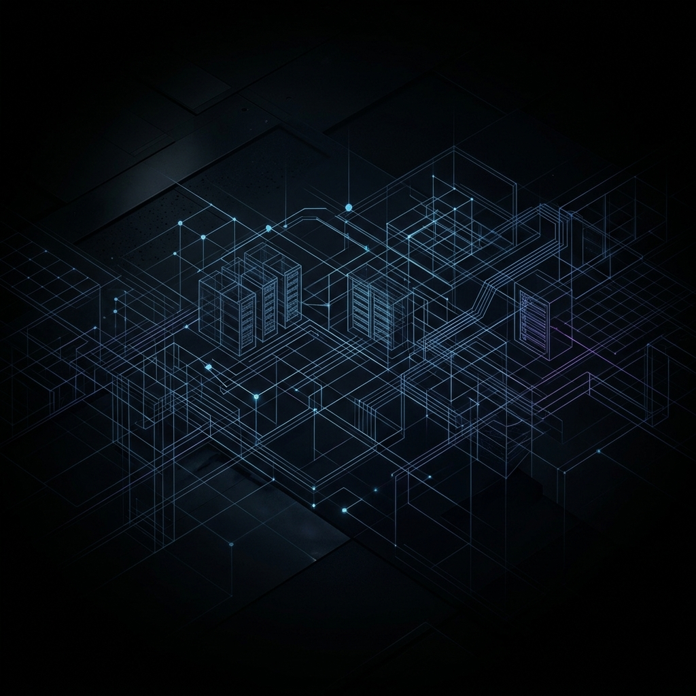

# MORPHEUS — Neural Sovereignty Engine

*DESTROY THE MATRIX*

**MORPHEUS** is a state-of-the-art neural entrainment and subconscious reprogramming engine. Combining real neuroscience, dynamic soundscapes, and focused visual feedback, MORPHEUS allows you to align your subconscious with targeted objectives in focused, 10-minute daily sessions.

 *(Note: Ensure paths are correct for local display. Refer to your active application ui).*

## Core Features

- **Brainwave Entrainment:** Precisely calibrated Binaural Beats targeting fundamental operating frequencies:
  - Delta (2Hz) - Deep Rest
  - Theta (6Hz) - Subconscious Reprogramming
  - Alpha (10Hz) - Awakened Relaxation
  - Beta (20Hz) - High Focus
- **Solfeggio Frequencies:** Ancient healing and resonant tunings (396Hz, 432Hz, 528Hz, 963Hz).
- **Acoustic Atmospheres:** 
  - Studio-grade **Endel** ambient soundscapes (Focus, Sleep, Brain Massage, etc.)
  - Nature-based synthesized layers (Ocean, Rain, Campfire, Wind).
  - Configurable Color Noise (Pink, Brown, White) for acoustic masking.
  - Generative MIDI Synth melodies.
- **Visual Sovereignty:**
  - Integrated **Vision Board:** Upload up to 8 images representing your desired reality.
  - Custom Axiom Overlays inside immersive visualizer sessions.
  - Generative Visualizer with high-fidelity Lottie animations.
- **Custom Audio Injection:** Upload your own personal track alongside the dynamically generated binaural beats and frequency modulation.
- **Session Intelligence:** Built-in protocol trackers to monitor total sessions, hold durations, and daily streaks. Includes a post-session journal.

## Architecture

MORPHEUS is structured as an offline-sovereign application, ensuring that your data, goals, and reprogramming configs remain totally private. It utilizes:
- **Frontend:** Vanilla HTML, CSS, and modern JS modules (`app.js`, `audio-engine.js`, `visualizer.js`, `session.js`, `vision-board.js`).
- **Core Technology:** HTML5 Web Audio API for robust, real-time frequency manipulation and synthesis.
- **Backend Environment:** Local Python-based `http.server` wrapper to bypass standard browser CORS restrictions and effortlessly serve multi-megabyte soundbanks directly to the Web Audio API without latency.

## Installation & Usage

Because of strict CORS security measures imposed by modern browsers, advanced Web Audio nodes cannot load large external asset files when accessing the app directly via the `file://` protocol. 

To activate the engine:

1. Open your terminal and navigate to the project directory:
   ```bash
   cd /path/to/MORPHEUS
   ```
2. Run the included engine script:
   ```bash
   ./start_engine.sh
   ```
   *(Alternatively, run `python3 -m http.server 8888`)*
3. Your browser will automatically open to port `8888`. Navigate to `http://localhost:8888/` if it does not.

## How To Use

1. Launch the engine via `start_engine.sh`.
2. Mix your desired **Atmosphere**, **Frequencies**, and **Noise Layer** in the dashboard grid.
3. Configure your **Vision Board** images.
4. Input your command code / **Axiom** (e.g., *I AM SOVEREIGN*).
5. Specify your desired session length (default 10m).
6. Click **▶ Activate Override** to drop into the immersive session. Let the frequencies play and engage with the visualizer and vision board overlay.

## Philosophy

*"Truth > Comfort."* MORPHEUS bypasses the limits of the conscious waking mind to imprint directly onto the 11-million-bit-per-second subconscious engine. Do not just use it; weaponize it to encode your sovereign structural commands.
